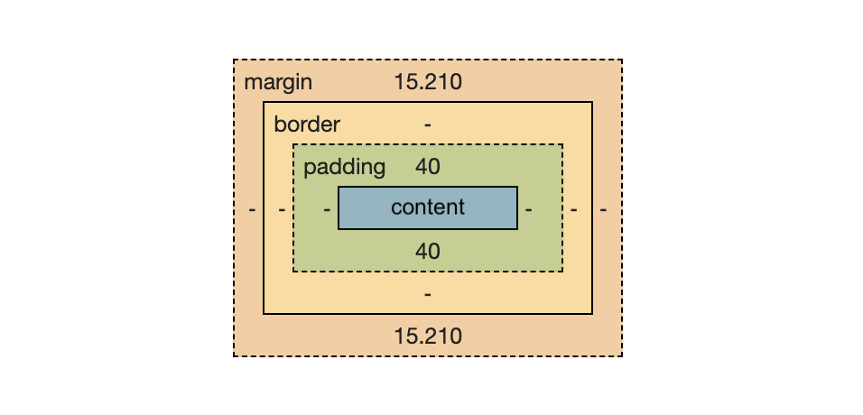

# <h>Course Outline</h>
Fall 2023

[Introduction](#introduction) - Whuuuut(s)?  
[Module 1](#module-1---foundations) - Foundations (HTML / CSS)  
[Module 2](#module-2---🍦-vanilla--asynchornous-javascript) - Vanilla & Asynchronous Javascript  
[Module 3](#module-3---working-with-external-libraries) - Working with External Libraries*  
[Module 4](#module-4---working-with-graphics--pixels) - Working with Graphics & Pixels*  
[Module 5](#module-5---coding-with-generative-ai) - Coding with Generative AI  
[Module 6]() - Developing Locally  
[Module 7]() - Using Git and Github  
[Module 8]() - Working outside the browser*  
[Module 9]() - Progressive Web Apps*  
[Module 10]() - Simple Web Servers*  

> Note: <b>*</b> indicates a module that last two weeks.

## Introduction

Welcome, everyone, to the class! Let's first introduce ourselves and talk about our interests. Then we will go over the syllabus, course outline, how to use the class website, how to contact me and Lucia, how to book drop-in hours, etc. We'll also discuss the ITP/IMA Code of Conduct.

📕 **Reading - due before class on Thu Sep 7th:** - 

1) Please fill out this [short questionnaire](https://forms.gle/GYPn86yeta4E1yTb9) so we can get to know you a little better.  
⏱ *Approx. time to complete: 5 minutes* 

2) Read the Wikipedia page on [net.art](https://en.wikipedia.org/wiki/Net.art) and share anything you find interesting, inspiring, offensive, or otherwise thought-provoking or worthy of discussion among the class. Put your thoughts in this [Google Doc](https://docs.google.com/document/d/1W8seghwUVAAKGFoHotT8pFpZQ_0sqcVdAEWvvIIsNuw/edit?usp=sharing).  
⏱ *Approx. time to complete: 40 minutes*

✅ *Total time: 45 minutes* 

## Module 1 - Foundations (HTML / CSS)

[CLASS NOTES](./modules/01-foundations-html-css/html-css.md) have moved!

Discussion topics:
- What is the internet? 
- How did the internet begin? [[1](https://www.britannica.com/topic/ARPANET)],[[2](https://en.wikipedia.org/wiki/ARPANET)]  

## HTML

HTML stands for Hyper Text Markup Langauge and it is composed of:

- Tags
- Attributes
- CSS selectors

In-class exercise:

1) Download a text editor like [VS Code](https://code.visualstudio.com/).

2) Using the [HTML boilerplate page](./modules/01-foundations-html-css/html-boilerplate.html) as a starting point, quickly work up an About Me page. The page should include:
    - Your name (your name perhaps or a pithy quip about yourself - *Gen Z introvert on the verge of complete public meltdown*🍦🤸🏼‍♂️✌️)
    - Hometown(s)
    - Educational background
    - A short story about what you did this summer, or perhaps a trip you recently took
    - Previous Occupation(s)
    - Hobbies
    - Interests
    - Pictures  
    - Videos 
3) Do not worry about making the page "look good". We are just making a list right now. We will use CSS to change the style later.

📕 **Reading - due before class on ~~Tue Sep 12th~~ Thu Sep 14th:**

Read Emma Rae Norton's [hand coding round robin](https://doodybrains.github.io/hand-coding-round-robin/) workshop guide for inspiration. There is also some interesting 'not required' reading. The HTML code for the workshop page can be found [here](https://github.com/doodybrains/hand-coding-round-robin/blob/master/index.html). 

>It's ok if there are things you don't understand on the page. Try to Google them, reference the W3 Schools site, or just make a note of your questions and book a drop-in appointment or pop up a hand in class! 

The code is written in such a way as to be more easily understood and read by humans. There is a intentional connection left bare between the code and the output, as if the author is letting you into the art studio to watch them paint - quite a different feeling from when you inspect the source of any modern-day sites which obscure much of the code, often by design.

Lastly, if you're not familiar with [School For Poetic Computation](https://sfpc.io/) (SFPC), check them out! They regularly do shows of student work which are always inspiring and thought-provoking. Lots of ITP/IMA alums are involved there as well.

⏱ *Approx. time to complete: 45 minutes to 1 hour* 

## CSS

CSS stands for Cascading Style Sheets.

- selectors
    - [W3 CSS selector guide](https://www.w3schools.com/cssref/trysel.php)
- properties
- how to apply
    - inline // `
Here's some green text!
`
    - internal // ``
    - external // `<link rel="stylesheet" href="style.css">`
- The Box Model
    - link to [Box Model playground](https://codepen.io/gabaza/pen/wEoLQY)

✔️ In-Class Exercise

1. Go to [Neocities.org](https://neocities.org) and create an account.
2. Using the interface, create a new folder called "01-foundations" and navigate to it. This is where you will upload Assignment 1.
3. Upload your `about-me.html` page inside of this folder or whatever you have called your file. You can also experiment uploading other pages and file types as well.
>This is how you will turn in your assignment link so get familiar with how to navigate these pages. Later, we will move to using Github Desktop and Github Pages.

📌 **Assignment 1 📌 - due before class on Tue Sep 19th:** 

Hand-code your own HTML web page and publish it Neocities. Here are some types of pages that you could choose for inspiration:
- an 'About Me' page, something people could read to get to know your personal history, interests, background, musical tastes, hobbies, etc. 
- a portfolio page which shares a bio and links to your artistic projects or professional portfolio
- a zine or other writing or illustration project
- a recipe page for making your favorite dish or perhaps a family recipe or tradition
- a wiki page about a topic that you find particularly interesting

Feel free to experiment and try some different things out. I'd like to see that you took the time to explore. Also, take a look at some of the student work from the Emma Rae Norton's [hand-coding-round-robin](https://doodybrains.github.io/hand-coding-round-robin/archive/) archive and see what kinds of things might be fun to try like, for example, the `<marquee>` tag, playing with `transform`, or getting completely wacky with `animation: rotate 1s alternate infinite;` 😅...

Here's a handy [HTML / CSS Cheat Sheet](https://docs.google.com/document/d/1yCs8SHUIhQGyLQt43A1Z5HUFX_ZTUm2rLhAkWBOILbw/edit?usp=sharing).

⏱ *Approx. time to complete: 3 hours*  
⏩ Submit the Neocities link to your assignment on [this form](https://forms.gle/qFmdmwFxJA1Jccs16).

## Module 2 - 🍦 Vanilla & Asynchronous Javascript  

[CLASS NOTES](./modules/02-vanilla-js/vanilla-js.md)  

>If HTML & CSS are the body and the clothing, Javascript makes us dance mmmmk 🤸🏼‍♂️
* Navigating the **DOM**
    - [The Document Object Model](https://www.w3schools.com/js/js_htmldom.asp)
* Using `document.getElementById()`
* Callbacks, making *do* without `draw()`
* `setTimeout()` to trigger events, make loops 🔄

- `async/await` using `fetch()`  
    - build API request with `URL`
    - anonymous arrow functions `() => {}` 
    - `try/catch` blocks for errors

Some relevant Coding Train Videos: 
- [setTimeout](https://www.youtube.com/watch?v=nGfTjA8qNDA&ab_channel=TheCodingTrain)
- [fetch & async/await](https://www.youtube.com/watch?v=tc8DU14qX6I&ab_channel=TheCodingTrain)
- 

📕 **Reading #2 - TO DO before class on Thu Sep 28th:**

We will be setting up Github accounts to turn in our classwork from here on out. Assignment 2 will be turned in and published as a Github Pages site. We will also be able to easily include Assignment 1 into this platform as well.

1. Create a [Github account](https://github.com). If you already have one, great.
2. Download and install [Github Desktop](https://desktop.github.com/). If you are already familiar (and adept?) with Git, that's fine too. Better yet, let me know!
3. Post the link to your Github account page to [this Google form](https://forms.gle/qFmdmwFxJA1Jccs16) under Reading 2. The format will be `https://github.com/yourusername` where `yourusername` is the user name you chose when you just signed up. For example, my link is `https://github.com/billythemusical`. 

📌 **Assignment 2 - API APP📌 - due before class on Thu Oct 5th:** 

Build your own interactive API app! You can pick from the list of app ideas below and make an interactive app that does the following:  

1. Takes user input of some kind - a button press, some text, location data, anything - be creative if you like! 
2. Sends that user input to the chosen API.
3. Displays the results of the API to your user in a visually compelling manner.  

>Kudos/bonus points for sleek UI/UX or totally retro/expertly awkward designs. ◻️ // 👹

- 🌦 Weather App (Medium)
    - Use the [OpenWeatherMap API](https://openweathermap.org/api) or a similar weather API to fetch the current weather for a given city.
    - Change the app background based on the weather condition using the fetched data.
    - Show the 5 day forecast!

- ⁇ Trivia App (Hard)
    - Use the [Open Trivia Database](https://opentdb.com/) to make a trivia game.
    - Let users can select:
        - category
        - difficulty
        - type of question
    - Keep score and manage multiple players

- 🛰 Space App (Medium)
    - Using [NASA's API](https://api.nasa.gov/), you can:
        - Explore the [Image and Video Library](https://api.nasa.gov/#:~:text=images.nasa.gov-,NASA%20Image%20and%20Video%20Library,-Use%20this%20API)
        - Get the [APOD](https://api.nasa.gov/#:~:text=of%20the%20Day-,APOD,-One%20of%20the) Astronomy Picture Of the Day
        - Get the latest Space Weather Database [Notifications](https://api.nasa.gov/#:~:text=06%26api_key%3DDEMO_KEY-,Notifications,-https%3A//api.nasa)

- 📰 News App (Medium)
    - Using the [NewsAPI](https://newsapi.org/) you can:
        - Give your users the latest headlines.
        - Let them search for articles on a subject.
        - Expand it to incorporate an accompanying image or video search API into the results (Google image or YouTube?)
        
- ✨ Roll Your Own (???)
    - Find your own (preferably free) API online or on a service like [API Ninjas](https://api-ninjas.com) and build your app according to the parameters set out above.

⏩ Once you're done, `commit` your changes in Github Desktop and `push` your changes to Github. Then share the link to your private repo [this form](https://forms.gle/qFmdmwFxJA1Jccs16).

>For now, this repo will be set to *private* so that your API keys are not exposed to the wider web. We will have set up your repositories to be shared with us instructors in the initial setup. Later work will be possible to use public repos and Github Pages.

⏱ *Approx. time to complete: 4-6 hours*  

## Module 3 - Working with External Libraries  

Check in on Assignment 2

[CLASS NOTES](./modules/03-external-libraries/external-libraries.md)

- p5.js our first external library 😂😉😎
- tidy up our HTML files using external files
- Rule of 👍🏼: load your libraries first, interactive scripts later
- placing p5 canvas on the page - [Processing/p5.js tutorial](https://github.com/processing/p5.js/wiki/Positioning-your-canvas#making-the-canvas-fill-the-window)
- CDN's
- minified libraries 

Fun external libraries
- Green Sock (gsap)
>Warning: You may see ANONYMOUS functions🕵️‍♀️ `() => console.log('say wha?')`
- Tone.js (using v.13)
- dat.gui

### Group Assignments
*...for Reading 3 & Assignment 3*  
- Jexi & Sarah  
- Joy & Pauline  
- Leah & Jalen  
- Q & Alyea  

### 📕 **Reading 3 📕 - due before EOD <ins>Fri Oct 13th at 11:59pm</ins>:**

We will be working in randomly chosen groups for these Assignments. Pick an an open source library that you would like to use for Assignment 3 below and share the name of the library and CDN link in the "link to assignment" space on [this Google form](https://forms.gle/qFmdmwFxJA1Jccs16). As long as one of you turns in the form, it will count for all in the group.

For example, if I was using the Green Sock library, my answer would be "Green Sock Animation Library https://cdnjs.cloudflare.com/ajax/libs/gsap/3.12.2/gsap.min.js"

Here are some you can choose from, but don't feel limited to these!  
- [Three.js](https://threejs.org/)  
- [Tone.js](https://tonejs.github.io/demos)  
- [ml5.js](https://ml5js.org/)  
- [dat.gui](https://github.com/dataarts/dat.gui)  
- [ZzFX Sound](https://killedbyapixel.github.io/ZzFX/)  
- ...or one of the many p5.js [contributor libraries](https://p5js.org/libraries/#:~:text=A%20p5.js%20library%20can,of%20the%20p5.js%20community)!

### 📌 **Assignment 3 - Working With External Libraries 📌 - due before class on Tue Oct 17th:** 

Now to spread your wings and fly out into the world of open source on your own! <ins>Only one person in your group needs to create the repo to turn in the assignment, but all should contribute to the work</ins>:  

1. Create a new repo called **03-external-libraries**.  
2. Demonstrate your chosen library in action on a web page of your own creation.  
3. You must use at least **three (3) separate methods** from the documentation.  
4. Use the **README.md** section of your new repo to provide documentation as to why your group chose this library, what you like about it, why you find it useful, what problems you ran into. Screenshots of console errors are helpful!  

>Style this special page using this [Markdown cheatsheet](https://www.markdownguide.org/cheat-sheet/). We'll be using the README page more now to document our work and process.  

### Submitting your work 

When your group is done, remember to:  
    - save your work  
    - `commit` it  
    - and `push` the changes to Github using Github Desktop!  

Turn in your group's final repo link (or Github Pages link) on [this Google form](https://forms.gle/qFmdmwFxJA1Jccs16) before class on Tuesday. Again, <ins>only one person in the group is required to do this.</ins> You will all receive the same grade for the assignment.  

# Module 4 - Working with Graphics & Pixels 

- In-Class Exercise - Drawing Upside Down
    - *adapted from [Drawing on the Right Side of the Brain](https://www.drawright.com/band-horizon)*  
- Lil-gui is dat.gui 
- [Open Processing](https://openprocessing.org)
- Clone [Generative Design](http://www.generative-gestaltung.de/2/) repo

📕 **Reading 4 📕 - due before class Thu Oct 19th:**

Watch this [Zach Lieberman talk](https://www.youtube.com/watch?v=bmztlO9_Wvo&ab_channel=AIGAdesign) on his creative coding and art practice and write your response on [this Google Doc](https://docs.google.com/document/d/13qiTdEAFMe6xNV__GAL6qeU2S3t1t2YOecvEUpRSNZ8/edit?usp=sharing).

⏱ *Approx. time to complete: 40-45 minutes* 

More creative coding links if you like:  
[Takawo - Daily Coding Live Sessions #05 \[ARTSCLOUD\]](https://www.youtube.com/watch?v=kqLCF_L22Fw&list=PLHCwOKNSdmFXg0-c7gOtqmtpzu8JOqIBF&index=5&ab_channel=shunsuketakawo) (Closed Captions can be set to English in the Settings ⚙)

📌 **Assignment 4 📌 - due before class on Tue Oct 24th:** 

### [📝 Print & Annotate Code Exercise](./modules/04-pixels/printing-code-exercise.md)

### Submitting your work

Take a photo(s) of your <ins>printed and hand-annotated</ins> pages and upload them to new Github repo called `04-pixels` and document your process in the README file. This can be a brief write up about:
- your experience with the exercise and any insight you gained
- interesting artists, sketches or themes you found on OpenProcessing.org
- interesting `code snippets`, techniques, or inspirations, etc.

Upload the link to your repo to [this Google form](https://forms.gle/qFmdmwFxJA1Jccs16) before class on Tuesday.

# Module 5  - Coding with Generative AI  

Hello [LLM's](https://www.youtube.com/watch?v=xmdR0Jvm2EY), goodbye homework!
- OpenAI
- Create OpenAI Account if you haven't already
- [ChatGPT login](https://chat.openai.com/) and [OpenAI API Developer Login](https://platform.openai.com/) 
- ChatGPT 3.5 turbo is free, fast, and great at coding
- ChatGPT 4 is 'better' and can process images, drawings

Issues
- The Problem of Alignment
    - What is alignment?
- Ethics
- Understanding Jailbreaking 
    - Examples: [1](https://x.com/goodside/status/1684803086869553152?s=20), [2](https://twitter.com/andyzou_jiaming/status/1684766170766004224)

Basic Terms/Parameters 
- Prompt/Seed Text
    - Initial text you provide to the model, "starts the conversation"
- Context
    - The model's ability to recall what you have previously said, including the prompt, aka the "memory" of the conversation
    - Limited based on the capabilities of the current model
- Tokens
    - How the LLM breaks the input text down into chunks, think syllables or building blocks
    - Limited based on the API
- Temperature
    - Controls the randomness of the output
    - Higher is more random/diverse, lower is more probable/consistent

Strategies for Prompting
- Prompting vs. Zero Shot/Single Shot
    - The more specific you can be, the better
- "Let's go step by step", although this has been more integrated into the current models lately
- ELI5... or High School Senior, Intermediate-Level Programmer, etc.
    - [In-class Example](https://chat.openai.com/share/0c9974e0-d89e-42a5-a072-9097559a4d75) explaining [TweetCode](https://twitter.com/hashtag/Processing?src=hashtag_click) with the resulting [p5.js sketch](https://editor.p5js.org/billythemusical/sketches/Zk_f0juMr)
- Trying custom prompts
    - [Example](https://x.com/sama/status/1682826943312326659?s=20) from OpenAI founder Sam Altman
    - [Example](https://twitter.com/kentcdodds/status/1702771901175836700?s=46) from a Typescript programmer
- Role Playing
    - "Pretend you are a programming expert with decades of experience. How would you write a web server with the utmost security in mind using Node.js and Express?"
- Feedback loop
    - "I got the following error(s) when I ran the code you suggested: \<paste the errors below\>"

Best Practices
- Save helpful scripts
- <ins>Don't</ins> TRUST <ins>and</ins> [VERIFY](https://twitter.com/svpino/status/1711736723179282744?s=46)
- Ask for "fully commented code"
- [Stay positive](https://twitter.com/nominus9/status/1693428898409619613?s=46)
- Specify platform, 'I am on MacOS Ventura'

>Share your own LLM or AI tips, tricks, and resources [here](https://docs.google.com/spreadsheets/d/1yW7pkUtGTup6b1TVjXyCSax2t4_uHNdNfDEgOSCN6QE/edit?usp=sharing).

### 📕 Reading 5 📕 - Intro Command Line due on Thursday, Oct 26th

- Read Sam Levine's [Intro to the Command Line](https://scrapism.lav.io/intro-to-the-command-line/) Tutorial. 
- Install any required software (Mac or Windows) and carefully follow along with the code examples. 
- Feel free to use Alice In Wonderland [alice.txt](./alice.txt) and this list of [names.txt](./names.txt) if you need text files to manipulate. Just make sure you change the commands from the tutorial to match your file names.

>Here is a helpful list of [Basic Linux Commands](./modules/06-developing-locally/basic_linux_commands.md) for your reference as well.

#### Submitting your work 

- Make a new repo **05-reading** and add any new files created from the tutorial. Upload the link to your repo to [this Google form](https://forms.gle/qFmdmwFxJA1Jccs16) before class on Tuesday.

⏱ *Approx. time to complete:* 1.5 hours 

## Module 6 - Developing Locally  

### Node.js

- What is [Node.js](https://nodejs.org/en/about)?
- [Installing](https://nodejs.org/en/download) Node.js 
    - check your installation with `$ node -v`
- ...or [Updating](https://www.freecodecamp.org/news/how-to-update-node-and-npm-to-the-latest-version/) Node.js
- Your first Node.js program(s)
    - [developing locally](./modules/06-developing-locally/developing-locally.md)
    - [working with cron](./modules/06-developing-locally/cron.md)
    - more [node examples](https://github.com/billythemusical/recode-fa23/tree/main/modules/06-developing-locally/node-examples) borrowed from the wonderful ITP/IMA prof [Allison Parrish](https://www.decontextualize.com/)
- Using [Cron](https://www.npmjs.com/package/node-cron) to schedule things
- Persistence with [pm2](https://www.npmjs.com/package/pm2)
- Using [Pushover](pushover.net) to send Mobile Notifications
- [Digital Ocean](https://m.do.co/c/489f0e4c7d15) to run our code remotely (always on)
    - [Initial Server Setup](https://www.digitalocean.com/community/tutorials/initial-server-setup-with-ubuntu-22-04)

### Setting up a remote computer with Digital Ocean

## Module 7 - Using Git and Github  

## Module 8 - Working outside the browser  

## Module 9 - Progressive Web Apps  

## Module 10 - Simple Web Servers  
