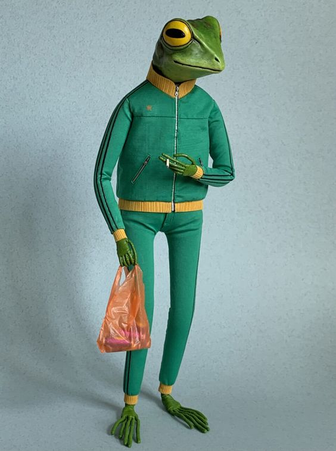

### HTML

> HTML is the body; CSS is the clothing!

The `<tag>` is primary building block of HTML. Tags typically have two parts - an opening and a closing tag. In the case of a `<div>` tag, it would look like this:
```html
<div> some content here </div>
```
Notice the addition of a forward slash `/` to close the tag, i.e. `</div>`. It's important to always mind your closing tags as HTML elements are nested within other elements. Most text editors will help you close your tags automatically with auto-complete. 

Here are some other examples of HTML `tags`:
- `<--! -->` - comments!
- `<!DOCTYPE>` - declares the document type, arcane, necessary? 
- `<head>` - used for metadata about the page, SEO, including other files, style sheets, etc.
- `<body>` - where the bulk of the page's actual 'content' will go
- `<footer>` - occasionally included but not necessary
- `<div>` - a generic divider or unit in the layout
- `<h1>, <h2>, ...<h6>` - text headings of various sizes   
- `<p>` - paragraph, has default properties pertaining to text
- `<a>` - anchor, used for links/hyperlinks, i.e. [google.com](https://google.com) <a href="https://google.com">google.com</a>
- `` - images, these include a `src` attribute for file path ``
- `<video>` - these also include a `src` attribute for file path `<video src="laptop.mp4"/>`
- `<audio>` - these include a `src` attribute for file path `<audio src="shout.mp3"/>`
- `<input>` - a flexible element, could be a text input, button, or other...
- `<button>` - the text/label for the button goes in between the opening and closing tags
- `<span>` - a swiss army knife for working with text
- `<li>` - lists, there are also unordered lists, tables, etc.
- `<canvas>` - remember me from p5??   
...

>Here is a [comprehensive alphabetical list of HTML tags](https://www.w3schools.com/TAGS/default.asp) from W3 Schools.

## HTML Attributes

Attributes allow us to provide additional information about HTML elements. These include things like:
- `alt`, specifies alternate text descriptions for an image, crucial for accessibility
- `width`, images will use their default file size if not specified
- `height`, images will use their default file size if not specified
- `src`, in the case of the `` tag
- `href`, in the case of the `<a>` tag
- `style`, where we can access any CSS properties

Certain attributes allow the user to target or designate the element for use in CSS, i.e. `id="myElement"`. These include the following, but there are others:
- `class`
- `id`
- `name`

Here is an example of an image with `alt` text description, a specified width and height, that when clicked, sends you to a website and is tagged with a CSS class name.
```HTML

```

### CSS

CSS stands for Cascading Style Sheets. CSS is used to style and format the HTML elements, which includes changing the color, size, and spacing, but also how the elements [animate](https://animista.net/) into view, like fading in or out or sliding on or off of the screen. 

CSS syntax is unique to itself. It looks a little like JSON with the brackets, so remember to mind the colons `:` and semi-colons `;`. 
```CSS
selector {
    property: value;
}
```

#### CSS Selectors
The CSS `selector` is how we target an element in the HTML. We can designate all the types of a particular tag on the page or just a single element and many complex combinations in between. 

For example, to make all of the paragraph elements on the page bold text, we could say:
```CSS
p {
    font-weight: bold;
}
``` 
Selectors can contain combinations of rules as well. For example, if you wanted to highlight the text inside any `<p>` tag with the `id` of "myCity" , you could do so like this:
```CSS
p #myCity {
    background-color: yellow;
}
```
This handy [W3 CSS selector guide](https://www.w3schools.com/cssref/trysel.php) shows some of the additional complexity involved in combining selections.

#### CSS Properties

Properties are all of the different types of things you can change, like colors, font characteristics, borders, padding, transform, rotation, etc. An exhaustive list is here

#### External Stylesheet
The more complex the styling of your page becomes, it is common to put all the CSS in an external `stylesheet` document, which is typically called `style.css`. This document can be be stored in the same folder as your `index.html`, or it can be pulled in from elsewhere on the web. To include the external `stylesheet`, use the `<link>` tag with the path to your file  in the `<head>` like so:
```HTML
<head>
    <link rel="stylesheet" href="style.css">
</head>
```

Take a look at some of the student work from the Emma Rae Norton's [hand-coding-round-robin](https://doodybrains.github.io/hand-coding-round-robin/archive/) archive and see what kinds of things might be fun to try (like, for example, the `<marquee>` tag, playing with the `transform` or `rotate` properties, or getting completely wacky with `animation: rotate 1s alternate infinite;` 😅...)



## The CSS Box Model

Each element on the page can be thought of as containing a series of boxes surrounding it. These boxes have default values, which can vary even based on which browser you are using. For this reason, you'll often see programmers write `html { margin: 0; }` at the top of their stylesheets to account for this. 

If we start from the middle, with the `content`, the size here is dependent on how large the content itself is, whether that is text - with its font settings, kerning, etc. - image, or video. After that, the `padding` will move the element, and we have control over top, left, bottom, and right independently. The same goes for the `border` property, which is usually set to 0 unless we turn it on. And finally, the `margin` property will add some whitespace to the element.

Here is a [Box Model Playground](https://codepen.io/gabaza/pen/wEoLQY?editors=0110) where you can change the box values to get a sense of how they interplay. It's helpful to have a `border` so you can see the difference between the `margin` and `padding` settings.


