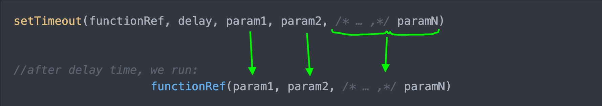

## Vanilla Javascript

p5.js simplifies many complicated Javascript operations into easier, user-friendly building blocks, much like its predecessor Processing did for the Java programming language. Each also used the same metaphor of "drawing on a screen" which appealed more immediately to artists and those who work in visual mediums.  

By simplifying many the complex and esoteric operations, p5.js provides a more intuitive framework which lowers the bar for entry into programming.  That is not to say that p5.js is only for beginners, as it is a community project with many hundreds of contributors and users around the world.

*** 

One of the goals of this class is to help you break out of the p5.js bubble and be able to adapt to the world of 'vanilla,' aka plain, Javascript.  Let's look at the code we wrote today in class which uses one of Javascript's many built-in functions, namely `setTimeout`.  

`setTimeout` first takes two arguments: a function or 'callback' and a delay time in milliseconds. The delay time is how long `setTimeout` will wait until it executes or 'calls' the callback function. 

```js 
setTimeout(callback, delayTime)
```

`setTimeout` can function as a recursive or repetitive loop. For example, in the code below, we can write a function called `move` which calls increments the value of `x` which controls the placement of an ellipse on the screen. After `x` is increased, `setTimeout` is called, which will call the `move` function again, after the delay time has passed, starting the process all over again. In this manner, we are creating a continuous loop.

```js
let x = 0  // variable we will use to move our ellipse
let delayTime = 200  // in milliseconds

function setup() {
  createCanvas(400, 400);
  move() // first call to our function, starting the loop
}

function draw() {
  background(220);
  ellipse(x, height * 0.5, 20)
}

function move() {  
  x += 10; // increment the x value
  setTimeout(move, delayTime) // call move() again after the delay time
}
```

>The `draw()` loop in p5 functions in a similar recursive manner, but employs the more robust [`requestAnimationFrame()`](https://developer.mozilla.org/en-US/docs/Web/API/window/requestAnimationFrame) browser API.

The image below shows the code from the [MDN documentation for `setTimeout`](https://developer.mozilla.org/en-US/docs/Web/API/setTimeout) which tells us that it takes the following arguments:
- a function reference
- an integer value for the delay time in milliseconds
- ... and any additional arguments you wish. 

*These additional parameters are passed into the function that we supplied as our first argument.*

  

>Don't let the `param1, param2, /* ...,*/ paramN` scare you. It just means that you can pass any number of parameters to `setTimeout` that you want - up to `paramN` where `N` is just a stand-in for however many you want.  

Let's try passing in additional arguments to `setTimeout` by rewriting our `inc` function below.  We'll use the variable `a` such that the ellipse will move across the screen at ever increasing amounts.  I'll also pass in a longer delay time so you can see the ellipse before it quickly goes off screen.

```js
function inc(a) {
    x += a // increase x by a
    a = x // set a equal to the increased x value
    setTimeout(inc, 200, a) // run inc again after 20 ms and pass in the additional argument a, essentially inc(a)
}
```
If you ran this code, you'll notice that you get an error. 👾 That's because we did not first declare `a` anywhere in our code.  While we could simply say, `let a = 20` before we declare our function, but there is a more streamlined way to fix the error.

```js
function inc(a = 5) { // declare a default value for a
    x += a // increase x by a
    a = x // set a equal to the increased x value
    setTimeout(inc, 200, a) // pass a back into inc
}
```

What's nice about this code is that it takes advantage of a Javascript shorthand and scope.  We give `a` a value at the time we declare the function and even if we don't pass an argument to `inc`, `a` will still have the default value of `5`. You can do this with any additional arguments as long as they are separated by a comma.

 > Note that `a` is not a global variable and has a limited scope that can only be used inside of the function `inc`.  Programmers often declare variables in this way to keep from "polluting the name space," which is a programming phrase that describes a situation where variable names could potentially clash with one another within your application or with the built-in browser functions and variables.

 🔗 Here's a great [Coding Train video](https://www.youtube.com/watch?v=nGfTjA8qNDA&ab_channel=TheCodingTrain) on setTimeout if you want to review!


## Anonymous & Arrow Functions

There are a number of Javascript quirks, or [syntactical sugar](https://en.wikipedia.org/wiki/Syntactic_sugar), that you will see as we venture outside of the p5.  One is that functions can be written in in various ways for readability and brevity.  Programmers are always seeking efficiencies, aka 'they are lazy.'  And when you're working with thousands of lines of code, shorthand syntax can be a huge benefit.

Let's take a look at the code below.  All three of these function declarations result in a function called `foo` that takes one argument `bar` and prints it to the console. Even though all three have the same result, there is one difference that this syntax introduces which we will discuss below.

>For more on why programmers use the 'foo' and 'bar' conventions, [read this Wiki](https://en.wikipedia.org/wiki/Foobar). 

```js
// 1. Standard function declaration 
function foo(bar) {
    console.log(bar)
}

// 2. Declare a variable using an anonymous function
const foo = function (bar) {
    console.log(bar)
}

// 2. Declare a variable using an anonymous function with arrow syntax
const foo = bar => console.log(bar)
```

> Note: Instead of p5's print( ) function, we will use console.log( ).  This will be important as we get outside of p5, but console.log will also print to the p5 web editor's console.

Number 1. is what you're used to seeing.  When a `function` is declared this way, the function will be called up or 'hoisted' when your code is compiled. This means that it's available to use from the start of your code.  So you could call the function `foo()` on line 1 of your code even before you declare it many lines later.  

Number 2. assigns a so-called anonymous function to the variable `foo`.  A function is anonymous when it is not assigned a name after the `function` declaration.  As such, this function is not 'called-up' and you can only use it after you have declared it.  [Here is a p5 sketch](https://editor.p5js.org/rostaccoli/sketches/H-_uQaQ5L) that demonstrates this behavior.

Number 3. also uses an anonymous function but drops the word `function` altogether.  Also, you'll notice that there are no parenthesis around the argument `bar`.  Since we are only passing 1 argument, we can exclude them.

Furthermore, Number 3. employs 'arrow function' notation which is denoted with an equals sign `=` and the greater-than `>` symbol, like so `=>`.  Think of the arrow as taking the place of the word `function`.  The arrow is also illustrative of the fact that the argument is 'passed into' the function.

>You won't use arrow notation `=>` anywhere else in Javascript except when dealing with functions.  

And finally for Number 3., we don't need to encapsulate it with brackets `{ ... }` since we are only writing one line of code after the arrow. This same behavior is seen in a shorthand `if` statement, like so `if(bar == true) console.log(bar)`.

Programmers use arrow syntax and anonymous functions quite often, so it's best to get familiar with it.  However, I don't recommend that you rewrite any of the built-in p5 functions this way, as it can cause errors.  Think of p5.js as a walled garden in which there are many beautiful things, but introducing outside code can threaten the ecosystem.  

*** 

### Var, Let, Const - which do I use???

**tl;dr** - use `let` instead of `var` in almost every case, and use `const` if you know the value you are using is not going to change (arrays and objects are considered constant if their contents simply modified).

As I pointed out above, Javascript is always changing and evolving as it is one of the most widely used programming language in the world and is being developed by many millions of programmers. You'll see some of the major corporate players, like Google, Facebook, or Microsoft, spearhead initiatives to codify a new syntactical practice, and they will work closely with non-profit foundations to propose and preside over new updates, with care not to break the code that came before it.  It's a very tough task with many moving parts, to say the least.  And what's more, programmers are very opinionated!

[ECMAScript 2015](https://www.w3schools.com/JS/js_es6.asp) was the name of the last major Javascript update which happened, you guessed it, in 2015.  It's generally referred to as 'ES6'.  This update introduced a number of significant changes, like arrow functions, which we discussed above, and new ways to declare variables.

The old way, you simply declared a variable with `var`.  ES6 introduced new declarations `let` and `const`.  For our purposes, the differences between `var` and `let` are less significant and you'll see a mixture of these still in use.  

`const` however is quite different.  Once you declare a variable with `const`, you cannot reassign it's value.  See the example below:

```js
const foo = 5
foo = 6  
// will throw an error

const bar = function () {
  console.log(foo)
}
bar = "new information"  
// will throw an error

const bar = []
bar[1] = 7
// this is fine since we are not re-assigning bar
// we are only manipulating the contents of the existing array

const bar = {}
bar.info = "new information"
// also fine since we are only manipulating the contents of the object
// not eliminating the object and reassigning the value of bar
```

For more info and examples, check out this [Free Code Academy link](https://www.freecodecamp.org/news/var-let-and-const-whats-the-difference/).


