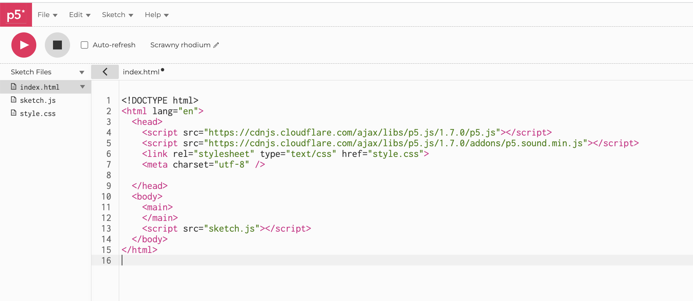

## Module 3 - Working with External Libraries

One of the greatest features of the web, and also maybe the most hard to believe, is the plethora of free and open source resources available on the internet.  Many of today's modern applications are built with them - Facebook, Instagram, Snapchat, Google, and more - and depend on technologies that were made freely available, for commercial use or otherwise.  As such, these companies often 'give back' by making internal tools available to the open source community, like Facebook/Meta has done with [React](https://reactjs.org/) and [Yarn](https://engineering.fb.com/2016/10/11/web/yarn-a-new-package-manager-for-javascript/), [Google](https://opensource.google/) has done with Chrome and [Tensorflow](https://opensource.google/projects/tensorflow?hl=en), and Snap has done with [Lens Studio](https://docs.snap.com/lens-studio/references/templates/overview), to name a few.  

Obviously, these companies have various motivations for releasing these tools, so you should view these with caution and understand that they could revoke the use of these at any time.  Also, you should consider that by including these tools in your projects, these companies values could pollute your own and the integrity of your work - so be aware of what you are doing and do your own investigations.

### p5.js Contributor Community 

p5.js itself is open source, as in, you can easily look at the source code.  It also has its own set of open source libraries which were developed to work easily with p5.js.  If you visit this page, you'll see that the types and quality of documentation varies.  This variation demonstrates one of the difficulties in working with software that is mostly free - without the incentive for compensation, developers lose interest in their project.  The nice thing is that p5.js has a group of managers and exists as a part of a the larger [Processing Foundation](https://processingfoundation.org/) community, which has many thousands of enthusiastic users from around the world, such that the code stays up , that many things do stay updated.

### Content Delivery Networks (CDN)

Content delivery networks are online repositories for code that can easily be included into projects via a web accessible link.  You can also download directly from these networks and include, or package, the code manually.  p5.js uses on, as you can see in the source of the script we use in the web editor.  

The drawback in using code in this way is that you depend on the CDN to make the code always available. Furthermore, as much code inevitably updates, you could lose access to old versions or mistakingly download the latest version which has breaking updates, aka updates that are not compatible with older versions of the code.

Later this term, we will look later at platforms like [Node.js](https://nodejs.org/en/) which have a streamlined way for you to download packages, via the Node Package Manager or [`npm`](https://www.npmjs.com/).  Package managers help you to keep an inventory of what code your project depends on, aka the project's dependencies, and easily add and remove various open source packages, of which there are thousands.

### Staying Organized

We can tidy up our HTML by moving our CSS and JS to external files:
```HTML
<link rel='stylesheet' type='text/css' href='./style.cs'>
```
The Javascript is typically included/loaded later as it will be "asking for" things in `document` that must be already available.
```HTML
<script type='text/javascript' src='./myScript.js' />
```

### Global mode vs. Instance Mode

When you include a library like p5.js in your HTML file, all of its built-in variables are available *globally*. This means that once the library is loaded, the built-in variables will be available anywhere you call for them in your code. That's why we generally load our library scripts at the top of the HTML file and run our interactive scripts later in the code.

This is all well and good most of the time. But as you start to build your projects out and things get more complex, you can run into **namespace** issues, where your function and variable names start to overlap with those of the library or even libraries themselves have competing or virtually identical function names. So programmers often try to avoid "polluting the global namespace" by avoiding using global variables where possible and encapsulating them functions or classes where their scope is limited.

 - Introducing **ES6 modules** and why we won't use them (for now).
 - All variables are available, which is great (most of the time)!

These files can of course be linked from the web, as in the case of p5.js when using the [p5 web editor](https://editor.p5js.org). 



### CDN's, aka Content Delivery Networks

You'll notice the root URL that provided the p5.js library is from a `cdnjs.cloudflare.com`. The CDN in `cdnjs` stands for "Content Delivery Network" which is a common entity among cloud services. It's a way for code libraries to have their code hosted by a reliable service online to be delivered to end-users and also provide a place to manage software versions. So if I wanted to load a previous version of the p5.js library, I could replace the version numbers in the URL  `.../p5.js/1.7.0/p5.js">`.