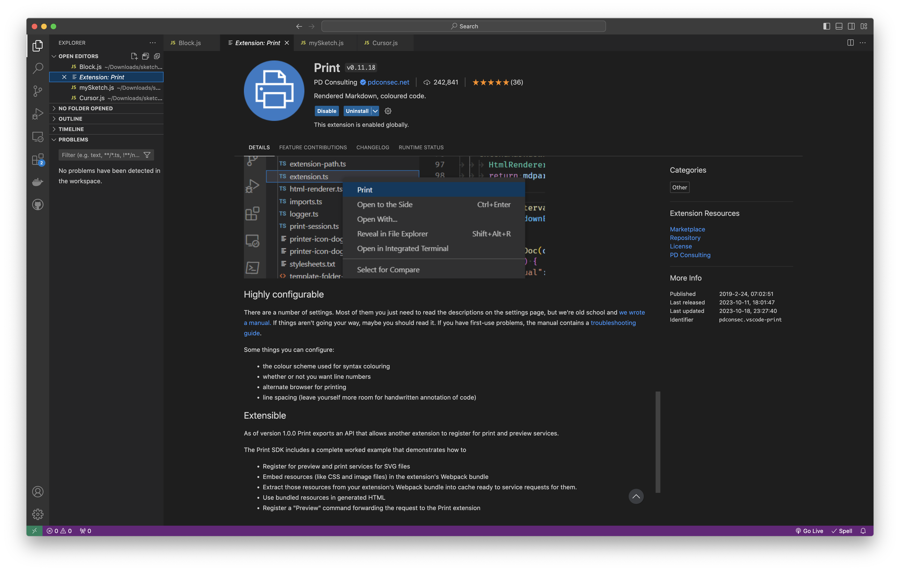
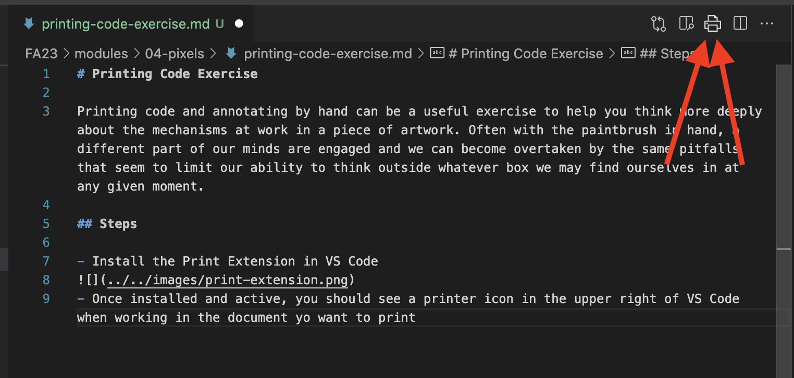
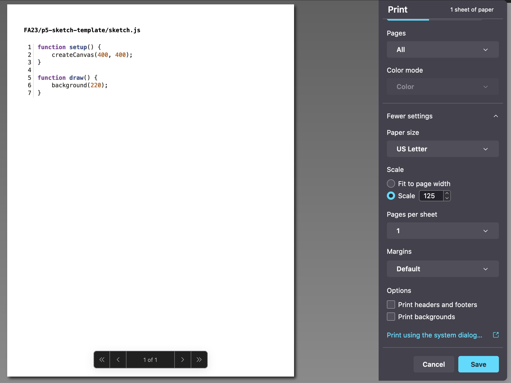

# Printing & Annotate Code Exercise

Printing code and annotating by hand can be a useful exercise to help you think more deeply about the mechanisms at work in a piece of artwork. Often with the paintbrush in hand, a different part of our minds are engaged and we can become overtaken by the same pitfalls that seem to limit our ability to think outside whatever box we may find ourselves in at any given moment.

## Choosing a sketch

- [OpenProcessing.org](https://openprocessing.org) is a great resource. Create a free account. You can easily explore, bookmark, and download a sketch that you like.
- Try to find one less than 100 lines and a single page.
- No shaders (sorry!)

## Steps to print

- Install the Print Extension in VS Code.  

- Once installed and active, you should see a printer icon in the upper right of VS Code when working in the document you. want to print.  
  
- This will allow you to print the code with the line numbers in tact!  

## Annotating  

- Go line by line and try to reason what each new calculation does as the code would compute it
- Skip the things that are obvious, like what `setup()` and `draw()` do
- Annotate clearly as if you were explaining the sketch to another programmer
- Look up new concepts that you don't now, programming, math, or otherwise