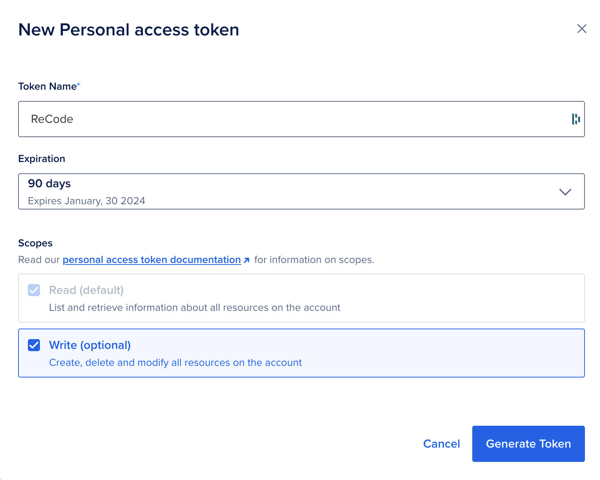

# Digital Ocean

## Setting up an account

If you haven't already, create a free account over at [Digital Ocean](digitalocean.com). 

They regularly give away $200 in free credits to students - [Referral Link](https://www.digitalocean.com/github-students). You'll have to put down a valid payment method first, but there's no need to worry. They're a totally legit company that I have used for years. 👍🏼

## Droplets

A droplet is a remote computer or virtual machine (VM for short). It runs in the cloud and has access to the internet. Theirs run on an OS called Ubuntu which is a Linux Operating system. Save some minor differences, it will behave much like the Unix (Mac) and Git Bash (Windows) terminals we have been using. 

It may or may not have Node.js and `npm` pre-installed. Just type `node -v` to check. If not, it will usually give instructions like `apt install nodejs` or something similar... `apt` is the `npm` of Ubuntu.

#### Why are we using Digital Ocean, you might ask? 

Well, other web apps like Glitch, Heroku and Replit do not allow you full control over your server applications and/or require you to "boost" them to keep them accessible 24/7. Digital Ocean droplets give you this control straight away. It's a bit less user-friendly up front, but the tools are much more robust and you'll learn valuable lessons along the way.

## Setting up a Droplet

#### Via Command Line 

You'll first need to generate a new personal access token. Go [here]((https://cloud.digitalocean.com/account/api/tokens/), click Generate, and make sure that the **Write** box is checked ☑️.



Copy the token and save it as a local environment variable using the `export` command like so: `export TOKEN="<your API token here>"` where `<your API token here>` is the API token that you just created.

Now when you run the lengthy `curl` command below (just copy/paste the command into your terminal and hit ENTER), the `TOKEN` variable will be included from the environment using the special `$` syntax, i.e. `$TOKEN`.

```bash
curl -X POST -H 'Content-Type: application/json' \
    -H 'Authorization: Bearer '$TOKEN'' \
    -d '{"name":"recode",
        "size":"s-1vcpu-512mb-10gb",
        "region":"nyc1",
        "image":"ubuntu-23-10-x64",
        "monitoring":true}' \
    "https://api.digitalocean.com/v2/droplets"
```

The output of this command will be a lengthy JSON object:
```bash
{"droplet":{"id":382884684,"name":"recode","memory":512,"vcpus":1, ...
```
>Here's the [full output](droplet-response.json).

### Setting the password

Since we created our Droplet via the Command Line (instead of using the web interface), we'll have to set our password by re-setting it. This is easy to do. 
1) Just go to your Droplets.
2) Click on the name of your newly created Droplet. 
3) Choose Access from the tabs on the left.
4) Choose "Reset root password"
5) Check your email for a new password.

### Accessing our Droplet

For now, we will use the Droplet Console that Digital Ocean provides. This saves us from having to set up SSH, which we will do later when we get into running our own web servers. 

Click on **Launch Droplet Console**. You'll then be prompted to put in your new password. 

### Using our Droplet

#### pm2

First we'll need to install `pm2` in our Droplet globally, like we did on our local machine. 

```bash
npm install -g pm2
```

#### Git clone

Now we'll have to get our code onto this mysterious remote machine, hidden deep within the bellows of a server farm, somewhere in New York State... 

Luckily for us, Git is also installed on this machine and the `git clone` command will clone any repository that we provide a URL as the next argument:

```bash
git clone https://github.com/billythemusical/notify-app
```

Once the repo is cloned, do the following: 

1) `cd` into the repo
2) `npm install` the dependencies
3) Add your own `.env` file with the following credentials:
```bash
APP_TOKEN=""
USERKEY=""
```
4) Start the app with `pm2 start notify.js`

#### Managing the pm2 process

Remember that `pm2` will remove the `.js` from your app name by default.

You can check the status of the all apps at any time by typing:
`pm2 status`
To check the logs, type (errors are in red):
`pm2 log`
To stop or restart an app, type:
`pm2 stop <app name>` or `pm2 restart <app name>`
To remove an app from `pm2`, type:
`pm2 delete <app name>`

#### Making Changes

To make changes to the app, you have to take a few things into consideration. Firstly, the code has already been compiled and is being managed and run by `pm2`. So any changes that you make will not affect the process that `pm2` is managing, similar to how the web browser won't show changes until refreshed. You have to stop the current `pm2` process and restart it in order for any changes to take effect. 

The process should go as follows:

1) Make changes, test, and debug on your local machine first
2) Commit and push the working code to Github
3) Go to your Droplet's repo and `git pull` the get the new changes
4) `pm2 restart <app name>` where `<app name>` is the name of your app

We always follow this process - develop locally, push to remote -  because it's much easier to test and debug locally than it is on a remote machine. And Git/Github makes this so much more convenient for us.