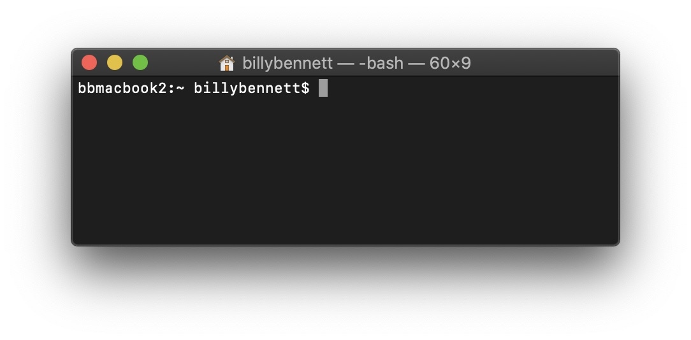

# Think Globally, Develop Locally

At some point in your coding journey, you may get the itch to develop some type of application that has a life of its own, beyond just a single sketch or web page. Perhaps that application enables you to collect and store user data in a database, or maybe you want to protect access to the app behind a login page, or maybe you want the app to complete some daily or hourly task like send an email or text... Whatever the case may be, learning Node.js will be a handy skill to posses. 

*But first...*

### The Command Line Interface

Since Node.js doesn't use a traditional GUI like the web browser, you have to first get familiar with using the Command Line Interface (CLI), aka 'the command line.' On a Mac, the command line is accessed from the Terminal app, which can be found in the Applications folder. When you open it, you will see the command prompt which may look something like this: 



What you're seeing is actually an entirely different operating system called Unix that lives on your Mac computer. Unix has many robust built-in functions that we can call by typing them into the command prompt. 

For example, open the Terminal app and at the command line prompt, type `echo` followed by a string in quotes and press return. This will simply print out or 'echo' the string to the 'standard output' - the terminal equivalent of the console log.

```bash
$ echo 'hello world'
hello world 
```

We can also pass special 'flags' to functions which are denoted by the addition of a single '-' or double dash '--'. A common flag that most functions accept is `--help` or `-h` for short. 

>Here is a more lengthy [command line tutorial](https://scrapism.lav.io/intro-to-the-command-line/) from Sam Lavigne's great course on web scraping called [Scrapism](https://scrapism.lav.io/) which also addresses those working in Windows.
---
### Node.js

Node.js is a Javascript framework that allows you to write code that runs on the host computer without the utilization of the browser. In fact, it's output is often just a console log. 

However, unlike the browser, Node is not subject to the same 'sand-boxed' safety limitations regarding the computer's hardware systems and computational resources. 

Node can also perform many specialized tasks like load, edit, and save files; manage complex databases; send emails or text messages (with the help of some useful API's); capture and edit audio and video files; and communicate with a wide variety of host hardware and peripheral devices, including bluetooth, cellular, and wifi devices.

### NPM

Node's real power lies in its built-in open source package manager called [`npm`](https://www.npmjs.com/), which simply stands for **Node Package Manager** (duh). 

`npm` has millions of open source code packages that we can install onto our computer just by typing a few commands. 

>'Installing' here simply means an automated way of doing the manual process we have used already - finding the library we need via a CDN, copying the code, and saving it to a file on our computer.


### Dependencies

Node packages are often built on top of other open source packages called **dependencies**. `npm` helps us manage a list of all of our dependencies in our project in special JSON files called `package.json` and `package-lock.json`. You'll start to notice these everywhere now. 🙃

Remember our `index.html` file in p5.js? We included all of the Javascript files we needed in our sketch with `<script>` tags. So you could say that our sketch *depends* on those files being there so we can access p5.js functions like `setup` and `draw`. 

But Node has no use for HTML (or CSS for that matter) because it runs outside the browser. It *only* uses Javascript. So we include whatever libraries we need at the top of our code using one of two methods: `require` or `import`.

- `require` is exclusive to Node.js
- `import` we have seen before and is the latest syntax

Here they both are in practice, including the Three.js:
```javascript
var THREE = require('three')

import * as THREE from 'three'
```

When `require` or `import` is called, Node checks the list of libraries that `npm` has installed and makes that code available for us to use, assuming the library is in fact installed and doesn't throw an error, which will happen sometimes.

>For a more in-depth breakdown of what happens when `import` is called, check out this [ChatGPT convo](https://chat.openai.com/share/6db5146b-8ad3-43f6-a781-23718aad1741).


### Writing our first Node program

To start a Node project we initialize a new one by saying:
```js
npm init
```
This will prompt a list of questions which `npm` wants to know about the project. In the future, if you just want to leave them all blank or default, you can use the `-y` argument.

Now you'll see the `package.json` file with any of the information you entered as well as the `package-lock.json` file, which won't have much in it, as we haven't installed anything yet. 

The first program we'll write will be a simple one for demonstration purposes. We will write a file to our computer, read the contents of that file, and print the contents to the console. 

```js
// fs is short for file system - a built-in module
const fs = require('fs');

// Write to a file
fs.writeFile('sample.txt', 'Hello, Node.js!', (err) => {
    if (err) throw err;

    console.log('The file has been saved!');

    // Read from the file
    fs.readFile('sample.txt', 'utf8', (err, data) => {
        if (err) throw err;

        // Print the contents to the console
        console.log('File contents:', data);
    });
});
```

Here we are using a callback to ensure that the contents of the file are written first before we try to read them. 

Save this file as `file-demo.js` and in your terminal, execute the program by typing: 
```javascript
$ node file-demo.js
```
If successful, you will see the following output:

```javascript
The file has been saved!
File contents: Hello, Node.js!
```

### Understanding Servers 
*Frontend vs. Backend, aka Client vs. Server*

**Frontend** code is typically consumed by the user, customer, or 'client' in the browser. The name comes from the fact that frontend code is the first thing the user interacts with and is therefore the the 'front end' of your application. 

**Backend** code runs 'in the background' and includes servers, databases, third-party software and any other underlying infrastructure that supports the operation of your app. 

While you may think, "Wait, I haven't written an app yet?!" you'd only be half right. Most of the backend code we've interacted with thus far has already been developed for us, whether that's Neocities, the VS Code Live Server Extension, or the p5 web editor (just check out the [p5 web editor github repo](https://github.com/processing/p5.js-web-editor)).