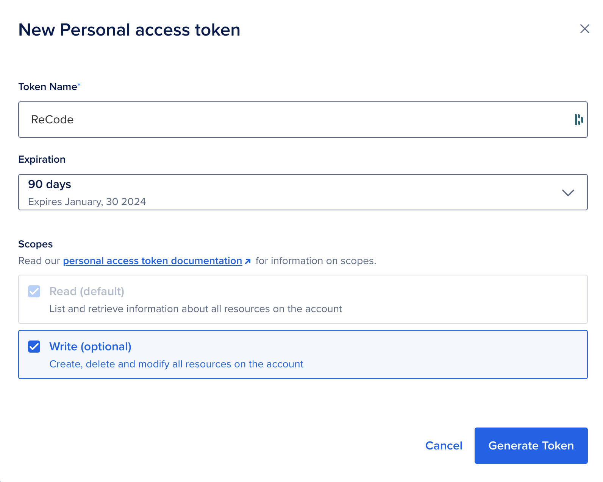
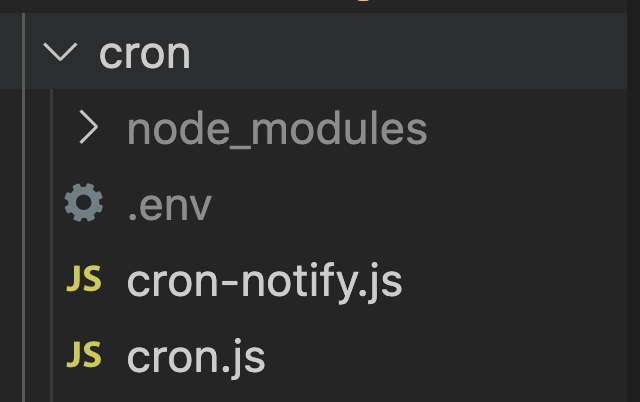
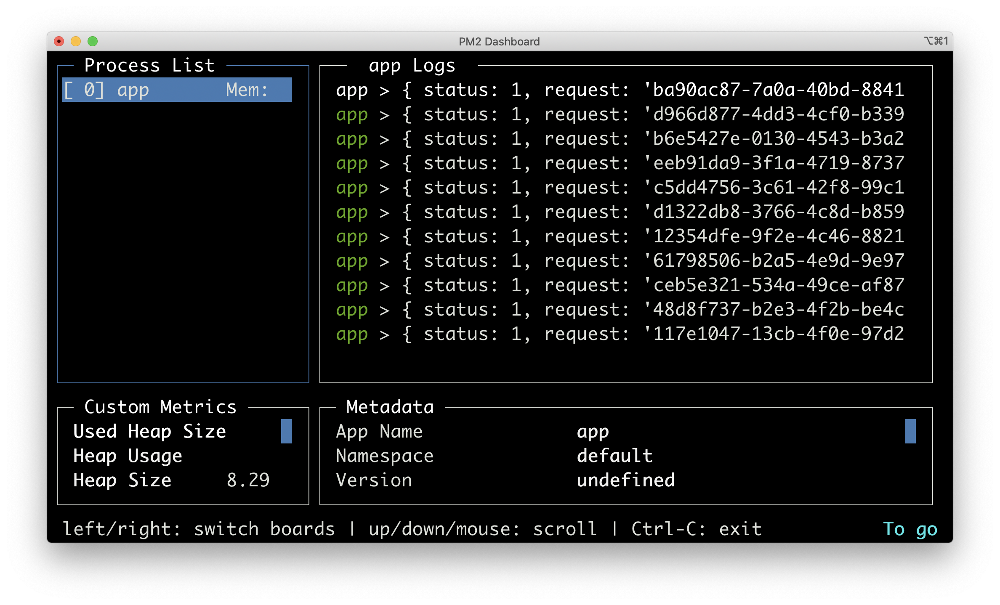
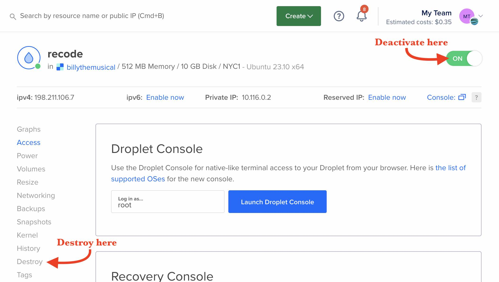

# Digital Ocean

## Setting up an account

If you haven't already, create a free account over at [Digital Ocean](digitalocean.com). 

They regularly give away $200 in free credits and have additional features available to students - [Referral Link](https://www.digitalocean.com/github-students). You'll have to put down a valid payment method first, but there's no need to worry. They're a totally legit company that I have used for years. 👍🏼


## Droplets

A droplet is a remote computer or virtual machine (VM for short). It runs in the cloud and has access to the internet. Theirs run on an OS called Ubuntu which is a Linux Operating system. Save some minor differences, it will behave much like the Unix (Mac) and Git Bash (Windows) terminals we have been using. 

#### Why are we using Digital Ocean, you might ask? 

Well, other web apps like Glitch, Heroku and Replit do not allow you full control over your server applications and/or require you to "boost" them to keep them accessible 24/7. Digital Ocean droplets give you this control straight away. It's a bit less user-friendly up front, but the tools are much more robust and you'll learn valuable lessons along the way.

## Setting up a Droplet

### Generating an API Token

You'll first need to generate a new personal access token. 
1. Go to the API tab in your console [here](https://cloud.digitalocean.com/account/api/tokens/), 
2. Make sure that the **Write** box is checked ☑️ and click **Generate**.
3. **Copy this token** as it will not be shown again.



### Using your API Token 

Now, we will use the `export` command in our local terminal like so: 
```bash
export TOKEN=YOUR_API_TOKEN
```
...where `YOUR_API_TOKEN` is the API token that you just created. This will create a local environment variable that we will call in the next command we run below.

>[Read more about local environment variables](environment-variables.md).

### Via Command Line

We can now create the droplet using `curl` command which will make an HTTP call to Digital Ocean's Droplet API.

When we run this lengthy `curl` command below, the `TOKEN` variable with our API key will be included from the local environment, using the special `$` syntax, i.e. `$TOKEN`. Just copy/paste the command into your terminal and hit ENTER.

```bash
curl -X POST -H 'Content-Type: application/json' \
    -H 'Authorization: Bearer '$TOKEN'' \
    -d '{"name":"recode",
        "size":"s-1vcpu-512mb-10gb",
        "region":"nyc1",
        "image":"ubuntu-23-10-x64",
        "monitoring":true}' \
    "https://api.digitalocean.com/v2/droplets"
```

If successful, the output of this command will be a lengthy JSON object:
```bash
{"droplet":{"id":382884684,"name":"recode","memory":512,"vcpus":1, ...
```
>Here's an example the [full output](droplet-response.json).

You will also get an email with the details of your Droplet including the **IP address** and **password**. You will need the password when you log in to the Droplet for the first time via the online console/terminal.

If there is an error, check that your API key is correct. You can do this by typing 
```bash
printenv | grep TOKEN
# outputs the value of the TOKEN variable
```
If the output of `TOKEN` does not match your API key, reassign the `TOKEN` variable again, i.e. `export TOKEN=YOUR_API_TOKEN`.

### Accessing our Droplet

For now, we will use the Droplet Console that Digital Ocean provides. This saves us from having to set up SSH, which we will do later when we get into running our own web servers. 

Click on **Launch Droplet Console**. You'll then be prompted to put in your Droplet password that was emailed to you. And then you will be asked to create a new password.

### Using our Droplet

We'll need to install Node.js and npm straight away. For this, we'll use `apt`. You can think of `apt` as just the `npm` for Ubuntu. If you get any pop-ups, you can hit enter or type 'Y' for yes.
```bash
apt install nodejs
```
... and then.
```bash
apt install npm
```
Then install `pm2` globally, like we did on our local machine. 
```bash
npm install -g pm2
```

### Moving local code to your Droplet

#### Ignoring .env file

Before you commit your local changes using Github Destkop, you'll want to first make sure that you don't commit your `.env` file, which has your Pushover API tokens. To do this, you add your `.env` file to the `.gitignore` file.

First, make sure you have a `.gitignore` file in the folder with your code and that is has the `.env` file listed. Here is an example [`.gitignore`](https://github.com/billythemusical/notify-app/blob/main/.gitignore) file from the `notify-app` [example repo](https://github.com/billythemusical/notify-app).

If done properly, the `.env` file will be grayed out in VS Code. *Remember to save your .gitignore file for the changes to take effect.*


<!--  -->

Once that is taken care of, commit your local changes using Github Desktop and push them to your Github repo. Then you can open this repo on Github and use the URL in the next step when we **clone** the repository in our droplet using the command line.

>The repo you are working with must be a **PUBLIC** repo in order to be cloned in the next step!

#### Cloning a Github repository

Even though the droplet is connected to the web, we can't use a web browser or a desktop app like Github Desktop to get our code onto it. But we can use the command line and `git` to download an exact copy of the code onto the droplet. This is a process called 'cloning' the repo.

To clone a repo, we simply use the `git clone` command and provide a URL as the next argument, e.g.:

```bash
git clone https://github.com/username/repo
```
... where **username** and **repo** in the URL are replaced by your username and the repo name you want to clone. So making the proper substitutions in the URL, clone the repo to your droplet using the command above.

When you clone a repo, a new folder is made with the name of the repo. You can see proof of this by running the `ls` command and seeing the name of your repo.

Then do the following in your droplet: 

1. `cd` into the new repo folder
2. `npm install` the dependencies
3. Add a `.env` file that matches your local `.env` file
4. Start the app with `pm2 start` and the script name you were working with.

#### Managing the pm2 process

Remember that `pm2` will remove the `.js` from your app name by default.

You can check the status of the all apps at any time by typing:
`pm2 status`
To stop or restart an app, type:
`pm2 stop <app name>` or `pm2 restart <app name>`
To remove an app from `pm2`, type:
`pm2 delete <app name>`
To check the logs, type (errors are in red):
`pm2 logs`
For a real-time monitoring, try:
`pm2 monit`



#### Making Changes

To make changes to the app, you have to take a few things into consideration. Firstly, the code has already been compiled and is being managed and run by `pm2`. So any changes that you make will not affect the process that `pm2` is managing, similar to how the web browser won't show changes until refreshed. You have to stop the current `pm2` process and restart it in order for any changes to take effect. 

The process should go as follows:

1. ON YOUR LOCAL MACHINE: 
    - Make changes 
    - Test
    - Debug
    - Commit and push the working code to Github
2. ON YOUR DROPLET: 
    - `cd` into the repo
    - `git pull` to get the new changes
    - `pm2 restart <app name>` where `<app name>` is the name of your app

>We always follow this process - develop locally / pull remotely - because it's much easier to test and debug locally than it is on a remote machine. And Git/Github makes this so much more convenient for us!

#### Deactivating or Deleting a Droplet

Droplets can be deactivated or deleted at any time. Deactivating is helpful if you have a runaway process or if the droplet is under attack 😱. *Droplets will still accrue charges though if deactivated.* Deactivating a droplet will maintain all of its files and configurations while deleting it will erase it from existence entirely (and cease to charge your account). 

To deactivate the droplet, simply toggle the **ON** switch in the upper right of the droplet console. To delete the droplet, click on "Destroy" from the options on the left and proceed with the instructions. 


