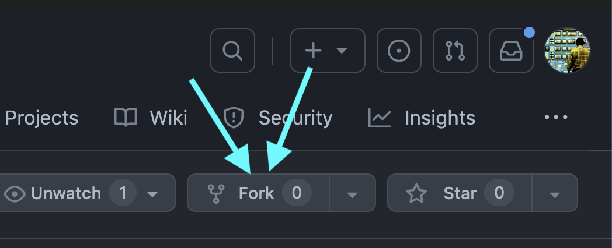

# Forking a repo

Forking a repo can be a way to work collaboratively on a project without having explicit permission from the original author. Forking will make a copy of that repo to your own account where you are free to modify and change the code as you wish, whereas cloning a repo will not allow you to push your local changes to your Github account, only copy the original code and save the changes locally. Furthermore, once you make a fork and push new changes, you can make a pull request to the original repo, if desired.

To FORK a repo, do the following:
1. Follow the link to the repo [HERE](https://stackblitz.com/~/github.com/billythemusical/normal-business-hours).
2. Click the FORK button.

<!--  -->

3. Choose a name, org, etc. and click "Create Fork"
4. Now you have created a **copy** of the repo under your own account.
5. Clone THIS FORK as normal, `git clone` and the URL of your fork.

Now when you make changes, you can commit and push them to your own fork as you wish.