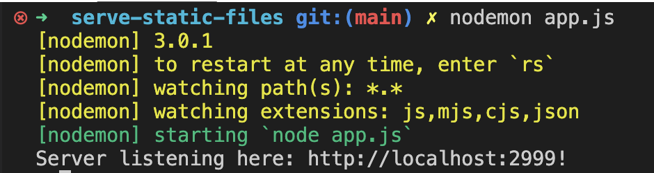
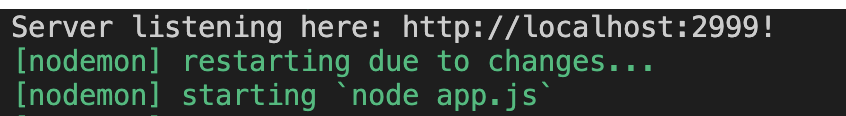

# nodemon

Starting and restarting your server each time you make a change can get cumbersome in development. Luckily for you someone else also got frustrated with that once and wrote an app called **nodemon**. Once installed as a global dependency (`npm install -g nodemon`), nodemon will listen in the root directory of your server for file changes and restart the server once it detects them.

Start your app now with `nodemon app.js`.

You'll notice from the output what the default watch paths and extensions are. These can all be changed, by either providing various flags to nodemon as launch, like `--watch` and `-e` respectively, or by providing your own `nodemon.json` file. I have provided an example example nodemon.json file [here](./nodemon.json) file that will watch html, css, and javascript files. 

When you make a change to any of the watched files and save it, you'll see the server restart in the terminal output like so:

This should get us *almost* all of the way to our Live Server app in VS Code, the only difference being a front-end live-reload javascript injection (we'd need webpack-dev-tools for something like this, but then we're not working so much in the backend anymore, and blah blah blah...)