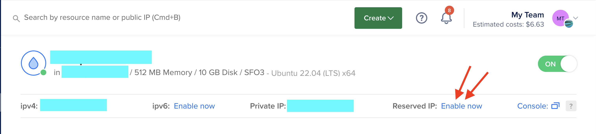

# Static IP Address

To find our server on the web, we need to have it's IP address remain in the same location. This is what we call a **static IP address**. Large cloud providers like Digital Ocean manage large banks of IP addresses so it's easier for them to have all their virtual machines be on floating IP address unless otherwise necessary, as was in the case of our notify app. It only sent messages out to Pushover, so it didn't matter to us where the messages came from.

For this assignment though, we will need to set up our droplet to be regularly accessible at a static IP address. This can be easily done on the [droplet console](https://cloud.digitalocean.com/projects/) once you've logged in. Just click on your droplet and you will see where you can enable **Reserved IP** as below. Just be aware that once you enable this, you will likely be logged out of the droplet terminal, if you were logged in, and the droplet will be restarted. 

  ### Domain Names

  >Not required for this assignment, but useful knowledge.

  Domain names are used by [Domain Name Systems](https://www.google.com/search?q=dns+meaning) (DNS) to point readable website names to IP addresses where web servers live and are listening. When you buy a domain name from a DNS like GoDaddy or NameCheap, these services link your domain name to an IP that you supply, allowing you to run your own server "behind" the domain name. Digital Ocean has a place in the web console to manage the domains you own and point them to your droplet.

  - Setting up HTTPS
  - HTTPS for ALL (EFF)