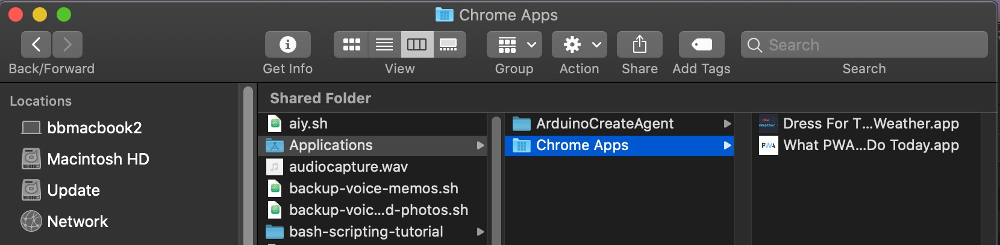

# Progressive Web Apps and You

### Overview

Progressive Web Apps allow us to create installable applications, leveraging the expanding functionality and built-in security features of the web browser. PWA's leverage the expanding functionality and built-in security features of the web browser while also providing a flexible user experience depending on the target platform, whether it be desktop or mobile. They are also able to mimic traditional software applications, with some limitations, without the developer overhead of app store approval, security checks, and cross-platform compatibility.

Reading
- [Web.dev PWA Overview](https://web.dev/learn/pwa/progressive-web-apps)

Class discussion  
- [Epic Games v. Apple](https://en.wikipedia.org/wiki/Epic_Games_v._Apple)
- [Tweets that don't age well](https://twitter.com/jack/status/1595864501437583367?s=20&t=AZrZvlU99AdRr_TZEzhM9A)
- [PWA Library](https://appsco.pe/)

Code References
[PWA Boilerplate Repo](https://github.com/billythemusical/recode-pwa-boilerplate)
[Responsive Web Design with Media Queries](https://www.w3schools.com/css/css_rwd_mediaqueries.asp)
[Debug Console for Safari iOS](https://www.lifewire.com/activate-the-debug-console-in-safari-445798)

Anatomy of a PWA

- [`manifest.json`](https://developer.mozilla.org/en-US/docs/Web/Manifest)
    - a list of all the assets in our app
- `service-worker.js`
    - drives the cache-ing behavior for offline usage, based on the files in the `manifest.json` 
- custom icons
    - 

CSS Considerations

[Media Queries](https://www.w3schools.com/css/css_rwd_mediaqueries.asp) help us understand what type of device our app is being viewed on. These apply as well to regular browsers, but PWA's have a few [special cases](https://web.dev/learn/pwa/app-design#media_queries) which we can read about here. When in play, we can specify custom CSS to handle these cases.

Debugging

- [Debugging on Web Pages on Mobile Devices](debuggin-on-mobile.md)
- [Lighthouse PWA Audits](https://developer.chrome.com/docs/lighthouse/pwa/)
    - An open-source tool for improving the quality of your web apps
    - Has specialized PWA tool

Assignment 

Build Your Own PWA

- Roll your own, a timer app with custom sounds and feedback, 

Considerations for mobile interactions like touch